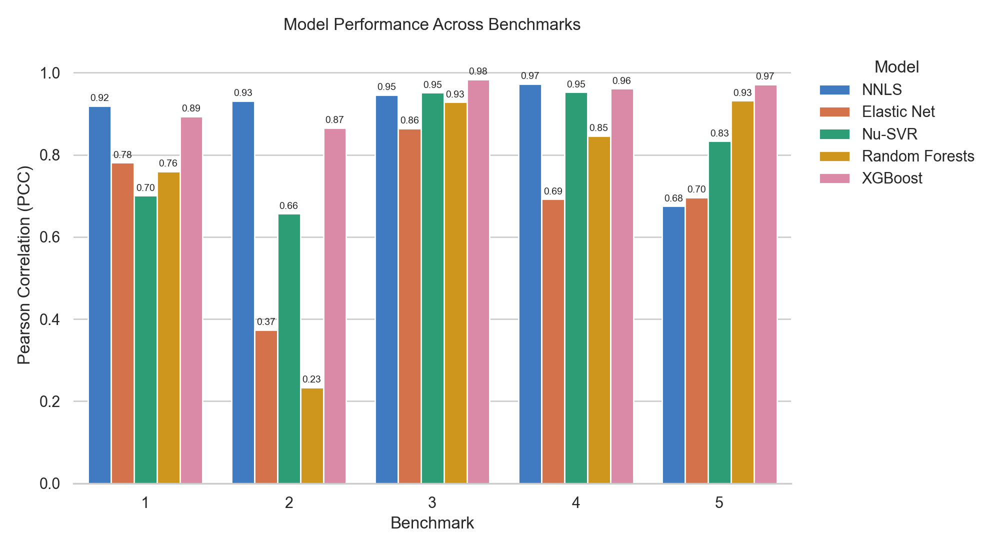

  
  <h1><b>MOSAIC:</b> Multi-Method Open Chromatin Solver for ATAC-seq Inference of Composition</h1>

A systematic benchmark and suite of machine learning methods for bulk ATAC-seq deconvolution. We evaluate a range of approaches — from Non-Negative Least Squares to XGBoost — to ask whether ML complexity necessarily translates to more accurate deconvolution results.

Benchmark data is made available at [zenodo](https://doi.org/10.5281/zenodo.21882636). Information on using the package, benchmark results, and replicating benchmarks is available in the [documentation](https://noahmarquie1.github.io/mosaic).

## Methods Tested

1. Non-Negative Least Squares (NNLS)
2. Elastic Net
3. Support Vector Regression (SVR)
4. Random Forests
5. Gradient Boosting with XGBoost

## Evaluation

Benchmarks were conducted using PBMC data from the study Granja et. al. 2019, provided by the Tsinghua Human scATAC-seq Corpus. We separate the data by sample (5 in the study), and perform five corresponding benchmarks, each where the ML models are trained using data from four samples, and a final sample is held out for evaluation. 

The strongest models for deconvolution surveyed here are NNLS and XGBoost, with XGBoost performing slightly worse than NNLS for most evaluations, but significantly better in the final test. We conclude that combinatorial models do not provide a significant advantage to statistical models in basic deconvolution use cases, but remain viable alternatives, with XGBoost in particular competitive to the predominant deconvolution methods in the current literature. 

## License

Mosaic is released under the [MIT License](LICENSE).
