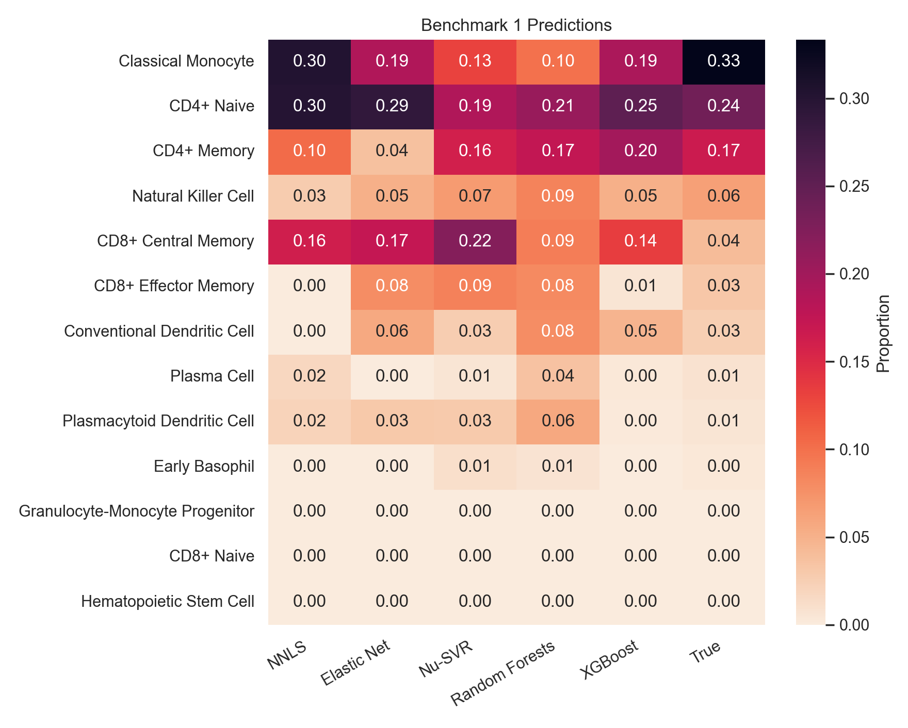
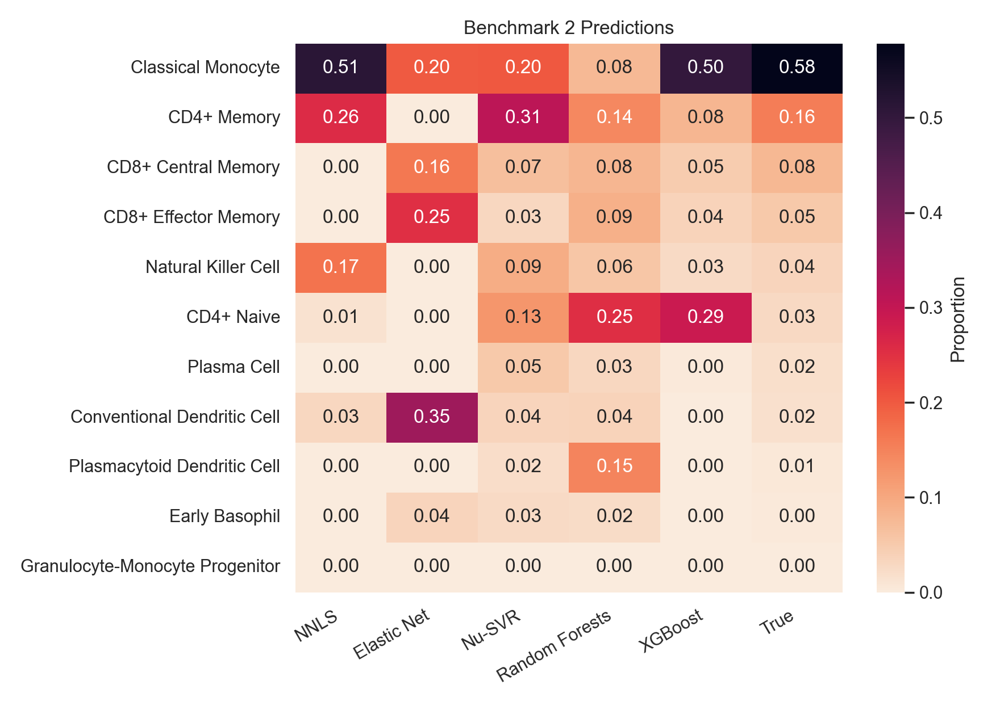
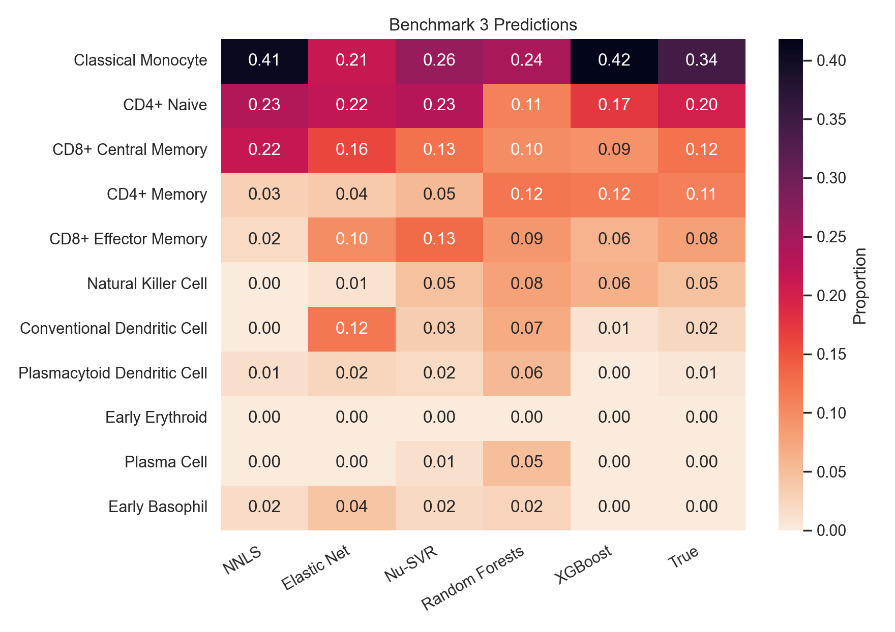
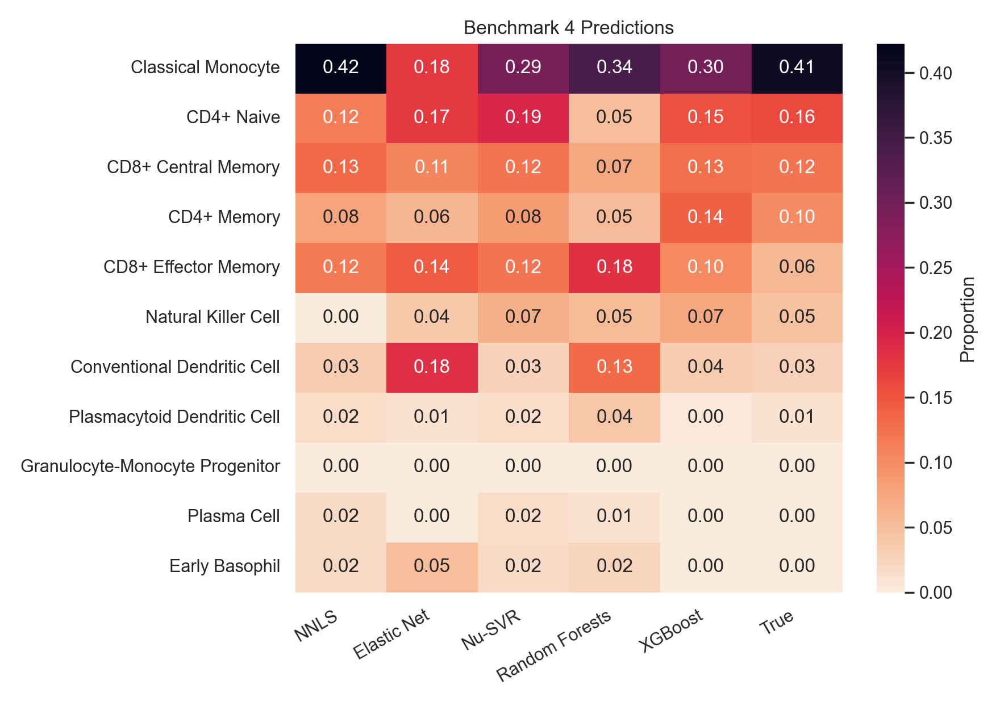
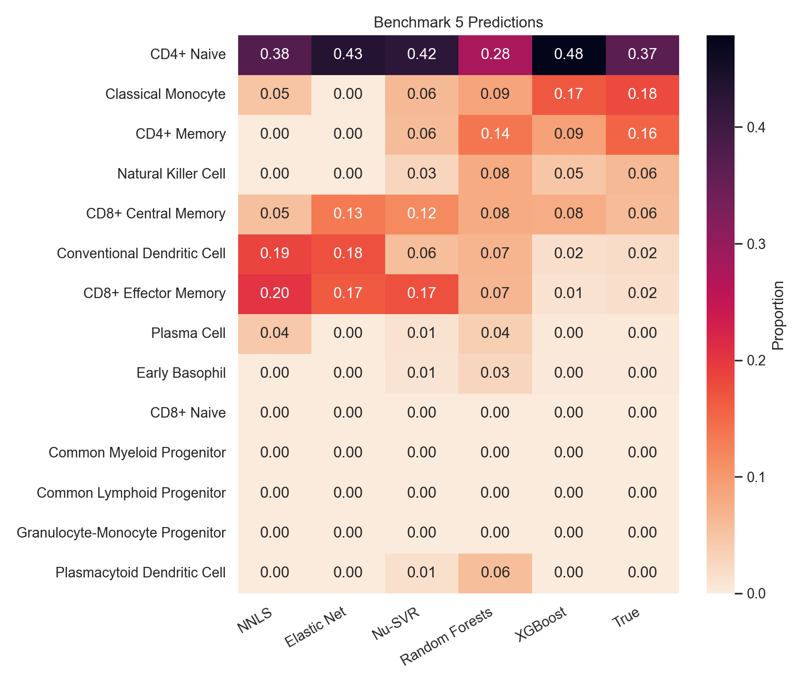

# Getting Started

Mosaic is a systematic benchmark and suite of machine learning methods for ATAC-seq based Cell-Type Deconvolution. We evaluate a range of approaches — from Non-Negative Least Squares to XGBoost — to ask whether ML complexity necessarily translates to more accurate deconvolution results.

## Project Structure

Mosaic is composed of two main parts:

1. Preprocessing
2. Deconvolution

The preprocessing module provides tools for building signature matrices, bulk mixtures and pseudobulks directly from AnnData format using SciPy, while the deconvolution module provides functionality to perform deconvolution using any of the five benchmarked ML algorithms

## Benchmarks

Benchmarks were conducted using PBMC data from the study Granja et. al. 2019, provided by the Tsinghua Human scATAC-seq Corpus. We separate the data by sample (5 in the study), and perform five corresponding benchmarks, each where the ML models are trained using data from four samples, and a final sample is held out for evaluation. 

### Replicating Benchmarks

Benchmark data is made available at [zenodo](https://doi.org/10.5281/zenodo.21882636). To replicate benchmarks, first unzip the `benchmark_data` zip file provided. Then call `python generate_benchmarks.py` to generate signature matrices, bulk mixtures, and pseudobulks for each benchmark using the MOSAIC's preprocessing module. Finally, run `example.py` to run deconvolution on the generated examples, which will give comparable results to those reported below.

### Overall Results

The strongest models for deconvolution surveyed here are NNLS and XGBoost, with XGBoost performing slightly worse than NNLS for most evaluations, but significantly better in the final test. We conclude that combinatorial models do not provide a significant advantage to statistical models in basic deconvolution use cases, but remain viable alternatives, with XGBoost in particular competitive to the predominant deconvolution methods in the current literature. 

### Individual Results

Below we provide individualized heatmaps for each of the five evaluations, showing the more nuanced patterns and biases for each model. For example, NNLS is often most accurate, except for strong peaks in areas with no true concentration. Additionally, Random Forests yields the flattest, safest proportion estimates of the five models. More patterns of this kind can be examined using the plots below.

#### Benchmark 1

#### Benchmark 2

#### Benchmark 3

#### Benchmark 4

#### Benchmark 5

